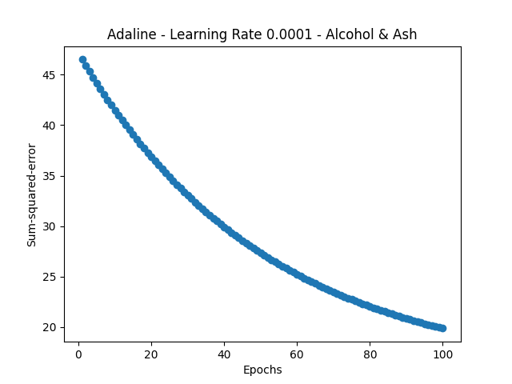
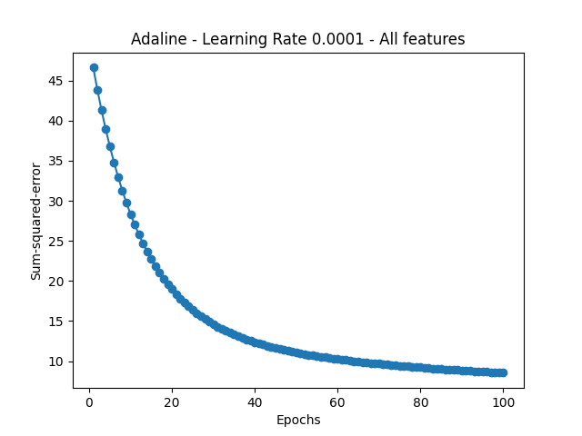
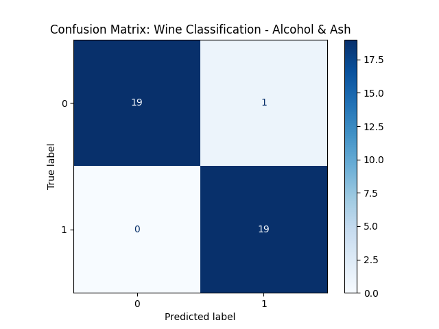
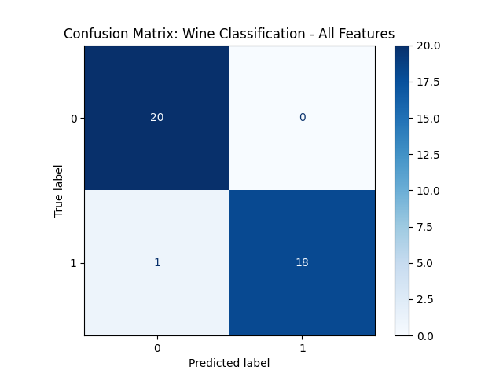
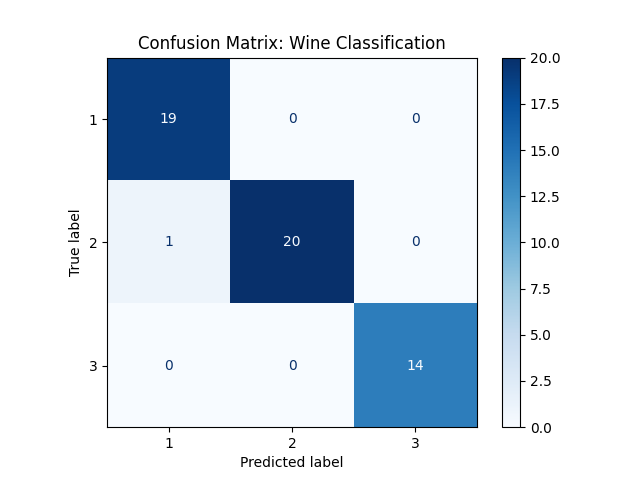

# Assignment 01: Linear Classifiers (Perceptron vs. ADALINE)

## 📌 Overview
This repository contains the implementation and comparative analysis of two fundamental neural models: the **Perceptron** and the **ADALINE** (Adaptive Linear Neuron), applied to the *UCI Wine Dataset*.

The focus of this activity was to understand how feature selection and hyperparameter tuning (such as learning rate) influence model convergence and classification accuracy.

---

## 🧪 Executive Summary: Theory vs. Practice

During the implementation and lectures, a crucial distinction between the models became evident:

* **ADALINE:** An exceptional pedagogical tool. It provides a clear view of **Gradient Descent** and how the cost function (Sum of Squared Errors - SSE) behaves. However, in its classic form, it is a binary classifier. For this project, a "Class 1 vs. Class 2" approach was implemented to analyze its convergence behavior.
* **Perceptron:** Proved to be more versatile in practice, natively handling the 3-class problem of the Wine dataset (using the Scikit-Learn implementation).
* **Conclusion:** ADALINE is ideal for optimization and convergence studies, supporting Professor André's point that for real-world large-scale implementations, the Perceptron and its modern extensions are more practical.

---

## 📈 ADALINE: Feature Analysis & Dimensionality Comparison

Following the assignment requirements, specific pairs of features were selected to evaluate the decision boundary. I also performed a comparison using the full feature set to analyze the impact of dimensionality.

### 1. Learning Convergence
Using a learning rate ($\eta$) of `0.0001`, the model showed a smooth decay in the SSE. I observed that with higher dimensionality (all features), the cost function decreases much faster, although 2D visualization remains essential to understand class separability.


<br>
*Figure 1: Learning convergence using only 2 features (Alcohol & Ash).*


<br> 
*Figure 2: Learning convergence using the full feature set.*

### 2. Confusion Matrix Analysis
When analyzing the dimensionality impact, the difference between using two features versus the full dataset proved to be remarkably subtle. Rather than eliminating misclassifications, adding more features simply shifted the error to a different quadrant:


* **Two Features (Alcohol & Ash):** The model produced a single False Positive, incorrectly classifying a true Class -1 sample as Class 1.


<br>
*Figure 3: Results using 2 features.*

* **All 13 Features:** The error flipped, resulting in a single False Negative, where a true Class 1 sample was mistakenly predicted as Class -1.


<br>
*Figure 4: Results using the entire dataset.*

This reveals that for the Class 1 vs. Class 2 boundaries, a 2D projection using the right features captures almost as much variance as the entire 13-dimensional space, with minor trade-offs in the error profile.

---

## 🤖 Perceptron: Multi-class Performance
The Perceptron was tested using the full set of 13 features. The result was near-perfect accuracy, demonstrating that the wine classes are linearly separable when sufficient information is provided.



---

## 💡 Evolution & Learning Notes (Python & Git)

This assignment marked a significant evolution in my development workflow:

1.  **Path Management:** Transitioned from `os.getcwd()` to `pathlib.Path`. This ensures project portability between Windows and macOS, allowing seamless work in VS Code without breaking file references.
2.  **Vectorized Operations:** Deepened my understanding of `NumPy` dot products. The efficiency of $w^T x$ over manual loops is the backbone of Machine Learning performance.
3.  **Git Hygiene:** Learned how to manage large datasets properly. I implemented a robust `.gitignore` and used commands like `filter-branch` and `gc` to purge large files (245MB) committed by mistake, keeping the repository professional and lightweight.
4.  **OOP in ML:** Implementing ADALINE as a class helped me understand how libraries like Scikit-Learn are structured internally.

---

## 🛠️ How to Run
1. Ensure you have `pandas`, `numpy`, `matplotlib`, and `sklearn` installed.
2. Run the scripts:
   ```bash
   python3 -m assignment_01_wine_perceptron_classification
   python3 -m assignment_01_wine_adaline_classification