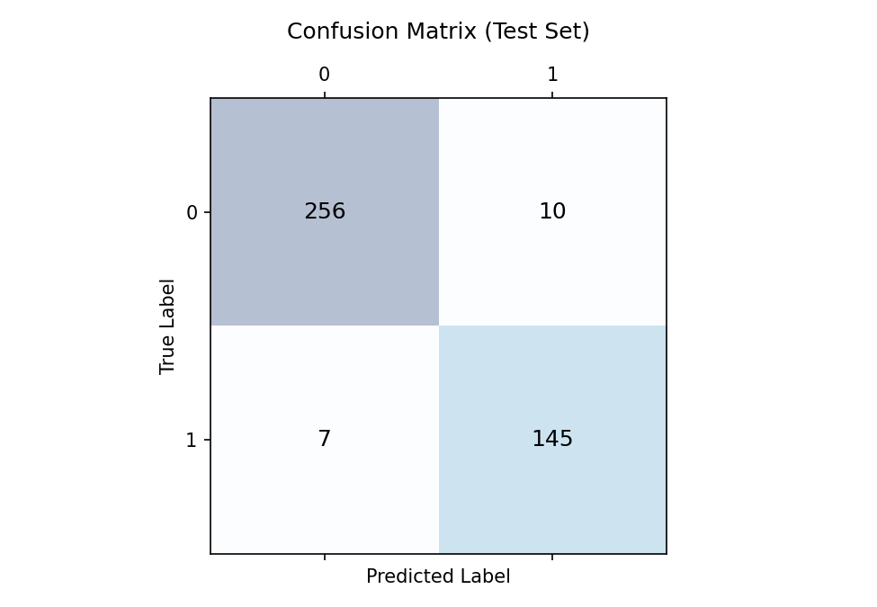

# Assignment 02: Titanic Survivor Prediction

**Course:** Pattern Recognition and Machine Learning - CPGEI-CT - UTFPR  
**Objective:** Develop a classification pipeline to predict passenger survival on the RMS Titanic using classical Machine Learning techniques.

---

## ⏱️ 1. Context & Objective
The sinking of the Titanic is one of the most infamous shipwrecks in history. While there was some element of luck involved in surviving, it seems some groups of people were more likely to survive than others. 
The primary objective of this assignment is to build a robust predictive model using **Logistic Regression** to determine whether a passenger survived or not, based on passenger data (i.e., name, age, gender, socio-economic class, etc.).

---

## 📊 2. Dataset & Feature Engineering
We utilized the standard Titanic dataset (separated into `train.csv` and `test.csv`). To ensure model robustness and avoid computational errors, rigorous data preprocessing was applied:

* **Feature Extraction:** Extracted the social `Title` (e.g., Mr, Mrs, Miss, Master) from the raw `Name` string to capture underlying socio-economic and gender-based survival priorities.
* **Feature Aggregation:** Combined `SibSp` (siblings/spouses) and `Parch` (parents/children) to create a single `FamilySize` feature.
* **Data Imputation & Anti-Leakage:** Missing values (NaNs) in `Age` and `Fare` within the test set were imputed strictly using the **median values from the training set**. This prevents data leakage and ensures the model evaluates true unseen data.
* **Categorical Encoding:** Mapped string labels (Sex, Embarked, Title) to numerical matrices for algorithmic compatibility.

---

## 🧠 3. Methodology & Architecture
* **The Model:** `LogisticRegression` embedded within a standardized pipeline.
* **Scaling:** Applied `StandardScaler` to ensure features with wider ranges (like `Fare`) do not disproportionately dominate the gradient descent optimization of the logistic model.
* **Validation:** Instead of evaluating the model on the training data (which causes overfitting blindness), predictions were strictly validated against the official `gender_submission.csv` ground truth provided by Kaggle for the 418 unseen test passengers.

---

## 📈 4. Results & Visual Analytics

The model achieved outstanding performance on the hold-out test set, demonstrating the effectiveness of the selected features.

<div align="center">
  
</div>

### Performance Breakdown
Based on the Confusion Matrix over the 418 test samples:
* **True Negatives (0,0):** 256 passengers correctly predicted as 'Died'.
* **True Positives (1,1):** 145 passengers correctly predicted as 'Survived'.
* **False Positives (0,1):** 10 passengers incorrectly predicted to survive.
* **False Negatives (1,0):** 7 passengers incorrectly predicted to die.

**Global Accuracy:** **~95.9%** (401 correct predictions out of 418).

### 4.1 Analytical Insight
The remarkably high accuracy indicates that the Logistic Regression model effectively converged on the dominant survival heuristics of the disaster (e.g., "Women and children first"). Because the validation ground truth (`gender_submission.csv`) heavily correlates survival with gender, the rigorous engineering of the `Sex` and `Title` features proved to be the decisive factor in the model's success.

---
### ⚙️ How to Run

1. Ensure the dataset files (`train.csv`, `test.csv`, `gender_submission.csv`) are located in the `/data/` directory.
2. Run the main script:
```bash
python3 assignment_02_titanic.py