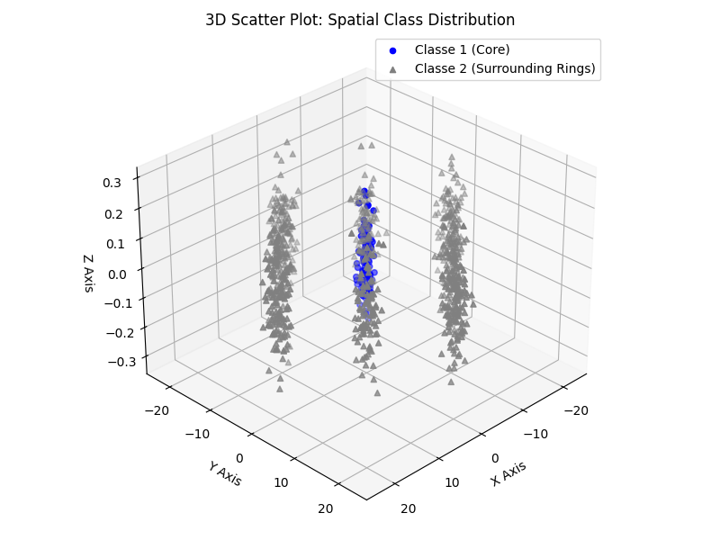
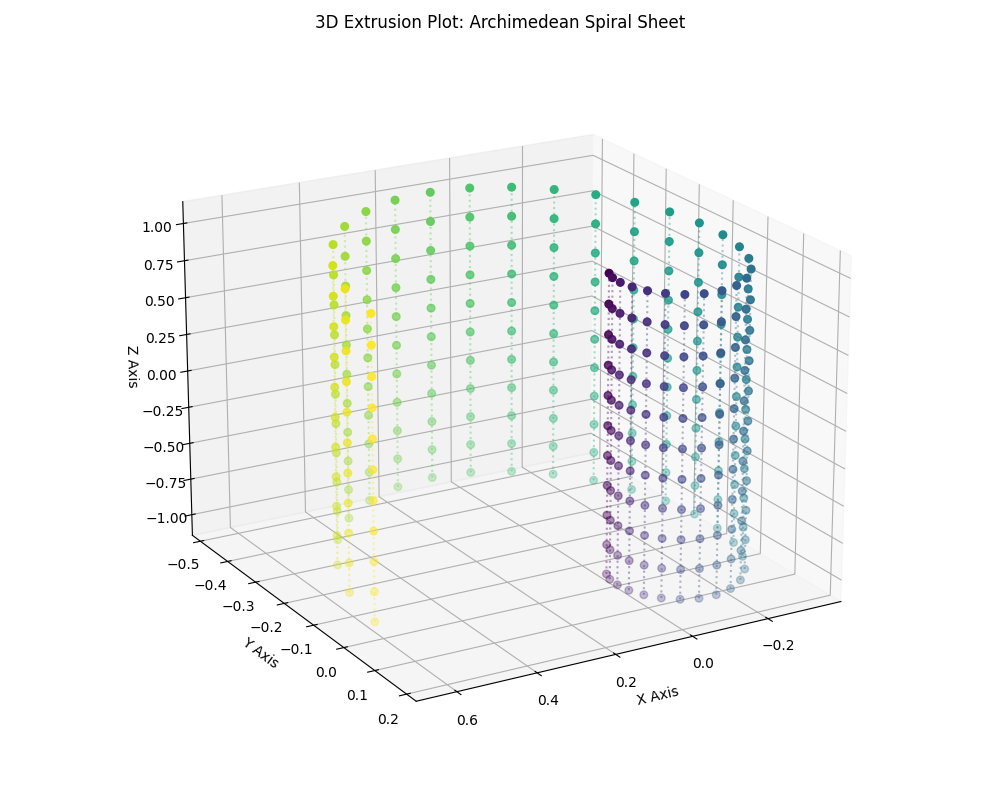
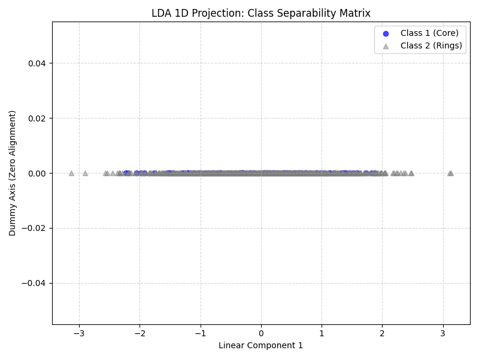
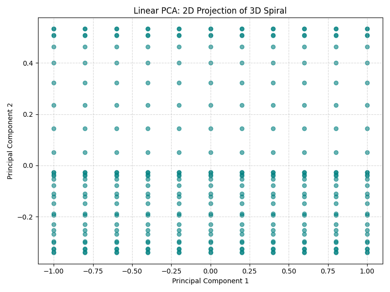
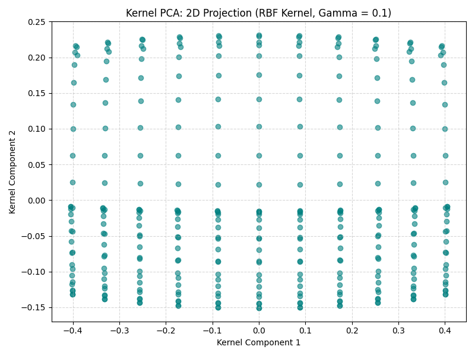

# Assignment 04: Dimensionality Reduction & Non-Linear Manifolds

## 📌 Overview
This directory contains the implementation and analysis of dimensionality reduction techniques applied to high-dimensional synthetic datasets. The goal of this assignment is to explore how reducing the number of features impacts computational efficiency, data visualization, and model performance.

The primary focus is to contrast the original high-dimensional feature space with lower-dimensional representations (such as 1D or 2D projections) while preserving as much variance or class separability as possible using **Linear Discriminant Analysis (LDA)**, **Linear PCA**, and **Kernel PCA (KPCA)**.

---

## 🧪 Theoretical Background & Objectives
In machine learning, high-dimensional data can often lead to the "Curse of Dimensionality," increasing computational costs and causing overfitting. This assignment explores both linear supervised and non-linear unsupervised techniques to mitigate these issues.

* **Objectives:**
  * Implement dimensionality reduction pipelines using standard libraries and structured math data stream generation.
  * Evaluate the mathematical and structural trade-offs between dimensionality, information loss, and classification accuracy.
  * Visualize high-dimensional manifolds when projected into lower-dimensional subspaces.

---

## 📈 Results & Visual Analysis

### 1. Mathematical Framework & Structural Challenges

#### 1.1 Dataset Generation & Vector Constraints
One of the core initial milestones was transitioning textbook equations into a robust computational pipeline. A primary challenge involved translating mathematical column vectors into Python. 

In linear algebra prose, sample means are strictly defined as column vectors, often written as $m_1 = [20, 0, 0]^T$. In native NumPy pipelines, forcing rigid 2D structures can lead to broadcasting matrix shape alignment errors during cumulative translations. Leveraging 1D arrays allows NumPy's native broadcasting engine to cleanly expand the mathematical transformation across contiguous slices without explicit structural transposition.

#### 1.2 Mathematical Foundations of Supervised Reduction (LDA)
Linear Discriminant Analysis (LDA) is a supervised algorithm designed to maximize class separability by projecting data into a lower-dimensional space. It computes an optimized projection axis that maximizes the distance between different class means while minimizing the variance within each individual class.

The matrix $S_w^{-1} S_b$ stands as the mathematical engine of LDA, where its eigenvectors define the newly optimized projection axes.

##### The Mathematics Behind $S_w^{-1} S_b$ and Fisher's Criterion
The foundational objective of LDA is to compute a projection matrix $W$ that maximizes **Fisher's Criterion**:

$$J(W) = \frac{|W^T S_b W|}{|W^T S_w W|}$$

The linear components capable of maximizing class discrimination are derived by calculating the eigenvalues and eigenvectors of the combined matrix $S_w^{-1} S_b$:

* **$S_b$ (Between-Class Scatter Matrix):** Measures the distance/separation between the mean of each individual class ($m_i$) and the global data mean ($m$).
* **$S_w$ (Within-Class Scatter Matrix):** Measures the internal variance or spread of data samples within their respective groups/classes.
* **$S_w^{-1} S_b$ (Eigenvalue Problem Engine):** Solving this generalized eigenvalue problem yields the optimal projection axes. Because the rank of $S_b$ is at most $C - 1$ (where $C$ is the total number of classes), the maximum number of extracted linear components is strictly bounded by $C - 1$. For a binary classification setup ($C = 2$), the projection is mathematically restricted to a single dimension ($1\text{D}$).

---

## 🧪 Executive Summary: Linear vs. Non-Linear Reduction

### Part 1: Gaussian Clusters & LDA Analysis
The first dataset combined a tight core (Class 1) surrounded by 8 distributed clusters (Class 2) forming a ring in a 3D space. 
* **LDA Limitation:** Due to the $C - 1$ component boundary, a binary classification layout restricts the projection to a single dimension ($1\text{D}$). 
* **Result:** Projecting concentric or surrounding data onto a single linear axis causes the core points (Class 1) to be sandwiched right in the middle of Class 2's data distribution. This highlights that linear supervised reduction struggles when classes are wrapped around each other non-linearly.

### Part 2: 3D Spiral Extrusion & Kernel PCA
The second challenge required handling a 2D Archimedean spiral extruded along the vertical Z-axis, creating a curved "curtain" sheet of data in 3D space. 

* **Linear PCA:** Handled the dimensionality reduction by effectively looking at the data from a top-down perspective, collapsing the vertical variance of the Z-axis, but kept the non-linear "coiled" layout intact in the 2D plane.
* **Kernel PCA (RBF Kernel):** Allowed mapping the data into a higher-dimensional space to attempt to unfold the spiral manifold. This technique proved highly sensitive to the hyperparameter **Gamma ($\gamma$)**:
  * **$\gamma = 0.1$ (Optimal):** Provided an excellent projection. The kernel's radius of influence was wide enough to respect the global geometry, cleanly linearizing the continuous structure of the spiral.
  * **$\gamma = 1.0, 5.0, 10.0$ (Aggressive Overfitting):** As Gamma increased, the model became hyper-specific to localized point distances. The continuous geometric structure collapsed, scattering the points into isolated clusters (spatial overfitting).

---

## 📉 Visual Progress

### 1. 3D Spatial Distributions



### 2. Dimensionality Reduction Outputs




---

## 💡 Evolution & Learning Notes
This assignment was a major milestone in mastering data translation workflows in Python and structuring scientific engineering repositories:

1. **Mathematical Extrusion:** Transitioned from basic 1D arrays to using `np.full_like` and multi-dimensional coordinate mapping to extrude a 2D mathematical curve into a 3D geometric sheet.
2. **Pipeline Progression:** Developed an end-to-end comprehension of feature engineering by tracking how data behaves when compressed from 3D to 2D linearly, and then observing the capabilities of non-linear Kernel transformations.
3. **Hyperparameter Intuition:** Gained a practical, visual understanding of how kernel scale boundaries alter the variance distribution of unsupervised models.
4. **Project Architecture:** Standardized filenames to `snake_case` and organized directory hierarchies under `assignment_04_dimensionality_reduction` for clean, professional repository health.

---

## 🛠️ How to Run
1. Ensure you have the required libraries installed (`pandas`, `numpy`, `matplotlib`, `scikit-learn`).
2. Execute the main pipeline script using python3:
   ```bash
   python3 assignment_04_dimensionality_reduction.py