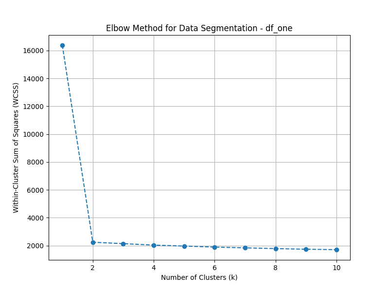
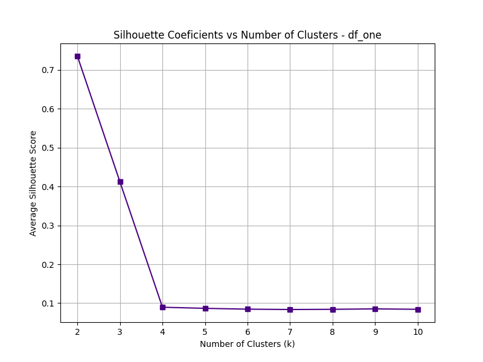
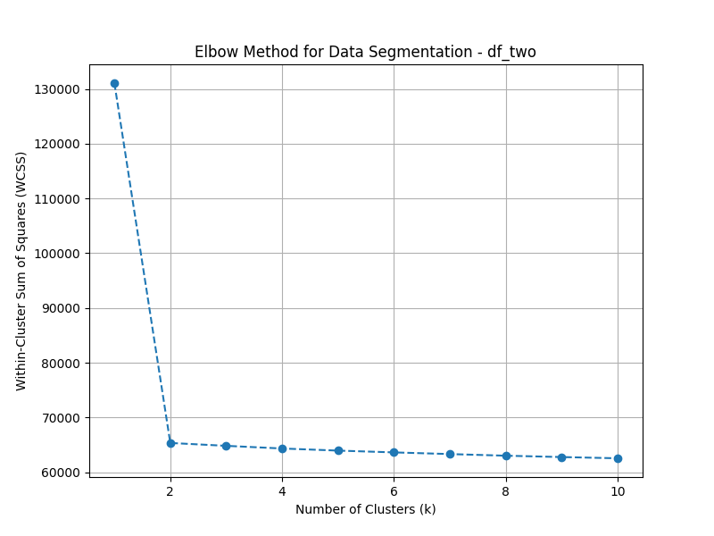
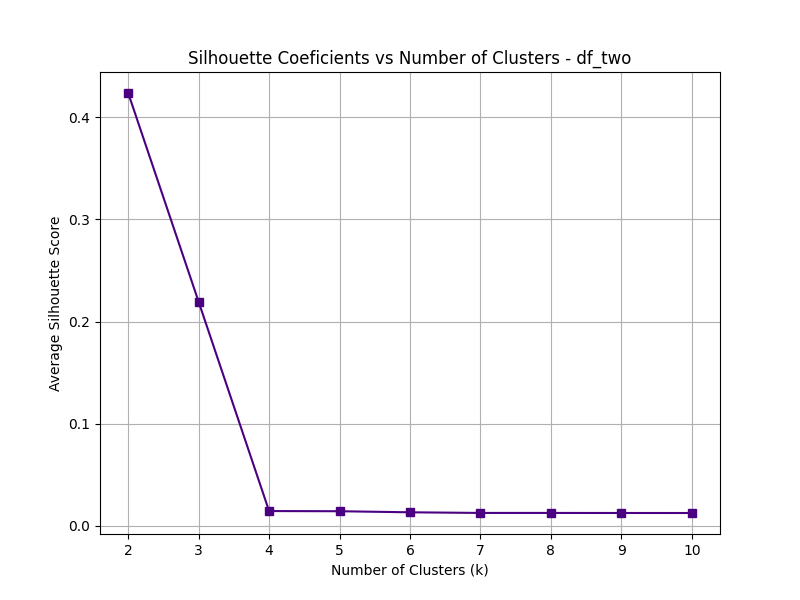
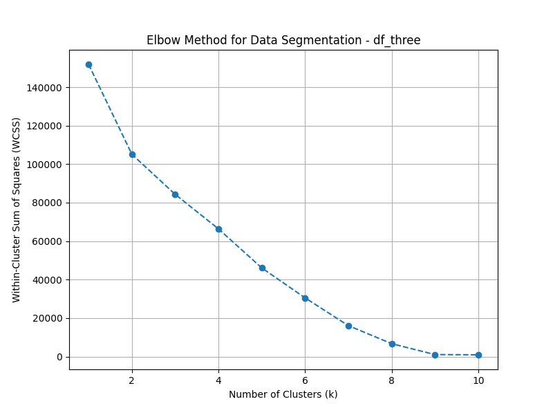
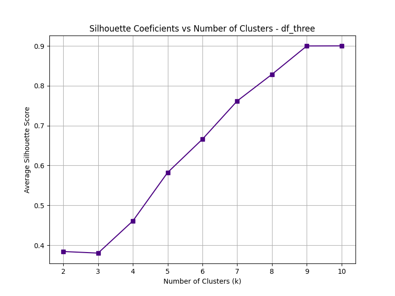
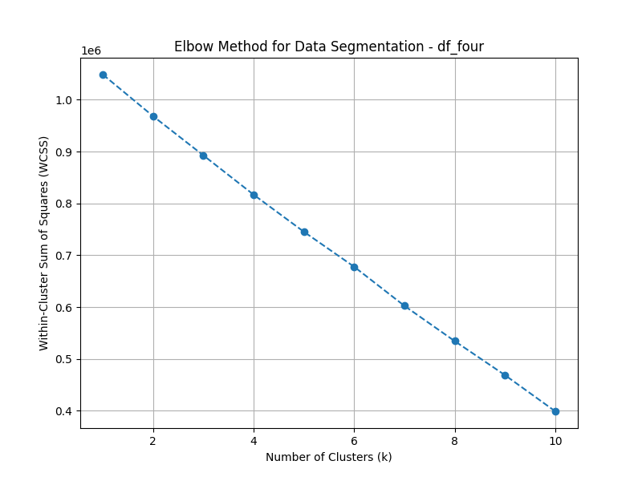
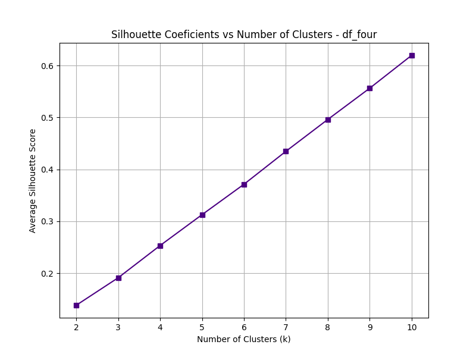

# Assignment 05: Unsupervised Learning & Clustering

## 📌 Overview
This directory contains the implementation and analysis of unsupervised clustering techniques applied to four unlabeled synthetic datasets. The primary objective is to autonomously determine the optimal number of clusters ($k$) for each dataset and validate the findings using multiple geometric evaluation metrics.

The pipeline implements **K-Means++** (prototype-based) and **Hierarchical Clustering** (agglomerative complete-linkage), leveraging intrinsic validation methods such as the **Elbow Method** and the **Silhouette Coefficient**.

---

## 🧪 Theoretical Background & Methodology

In unsupervised learning, where ground truth labels are absent, the performance of clustering algorithms relies on two geometric forces:
* **Cohesion:** How closely related objects are within the same cluster.
* **Separation:** How distinct or well-separated a cluster is from other clusters.

### Algorithm Selection
1. **K-Means++:** Chosen for its speed and initialized using the `k-means++` algorithm to prevent poor local minima convergence by spreading initial centroids probabilistically.
2. **Hierarchical Clustering (Complete-Link):** Utilized to construct a dendrogram. Complete-linkage (measuring the maximum distance between cluster elements) was selected to favor highly compact, spherical clusters and resist the chaining effect (noise).

### Validation Metrics
* **Within-Cluster Sum of Squares (WCSS / Inertia):** Mapped across $k=1$ to $10$ to identify the "Elbow", the inflection point where marginal error reduction diminishes.
* **Silhouette Coefficient:** Calculated to measure overlap. It ranges from -1 to +1, where values closer to +1 indicate exceptional cohesion and separation. The algorithm was automated to autonomously select the $k$ that maximizes this score via `np.argmax`.

---

## 📈 Results & Visual Analysis

### Dataset 1 (`df_one`): High-Cohesion Spherical Segmentation
* **Validation:** The Elbow curve shows a severe drop from $k=1$ to $k=2$, flattening out immediately after. The Silhouette coefficient corroborates this perfectly, peaking at an outstanding score of **~0.73** at $k=2$.
* **Conclusion:** This dataset consists of two highly isotropic and well-separated structures. The automated pipeline successfully identified $k=2$ as the optimal parameter.

<div align="center">
  
  
</div>

### Dataset 2 (`df_two`): Moderate-Cohesion Segmentation
* **Validation:** Similar to the first dataset, the Elbow curve hinges at $k=2$. However, the initial variance is significantly higher. The Silhouette coefficient peaks at $k=2$ with a score of **~0.43**.
* **Conclusion:** While $k=2$ is mathematically the optimal number of clusters for this feature space, the lower silhouette score compared to `df_one` indicates that the clusters are either wider (higher variance) or closer together, showing slight overlapping boundaries.

<div align="center">
  
  
</div>

### Dataset 3 (`df_three`): The Extreme Density Phenomenon
* **Observation:** The WCSS for `df_three` plunged linearly and practically hit zero at $k=9$. 
* **Analysis:** An inertia of zero implies that the distance between data points and their respective centroids is non-existent. This indicates that the dataset is composed of 9 micro-clusters of extreme density, or 9 exactly repeated coordinate pairs. The automated Silhouette score successfully locked onto $k=9$ as the peak structure.

<div align="center">
  
  
</div>

### Dataset 4 (`df_four`): Topologies Beyond K-Means
* **Observation:** The Elbow plot for `df_four` exhibited a near-perfect diagonal linear drop from $k=1$ to $10$, failing to present any structural "elbow."
* **Analysis:** K-Means strictly assumes that clusters are convex and spherical. When applied to non-linear topologies (e.g., concentric rings, elongated spirals) or pure uniform noise, the algorithm merely partitions the spatial volume into arbitrary pieces. This results in a linear drop in variance without finding natural boundaries.
* **Future Work / Iteration:** For complex manifolds such as `df_four`, density-based spatial clustering algorithms (such as **DBSCAN**) are required, as they can isolate noise and navigate non-convex geometries without requiring a predefined $k$.

<div align="center">
  
  
</div>


---

## 🛠️ How to Run
1. Ensure the required dependencies are installed (`pandas`, `numpy`, `matplotlib`, `scikit-learn`, `scipy`).
2. Inside the main script (`assignment_05_clustering.py`), locate the `DF` variable in the Definitions section.
3. Set `DF = 0, 1, 2, or 3` to select the respective dataset.
4. Run the script:
   ```bash
   python3 assignment_05_clustering.py