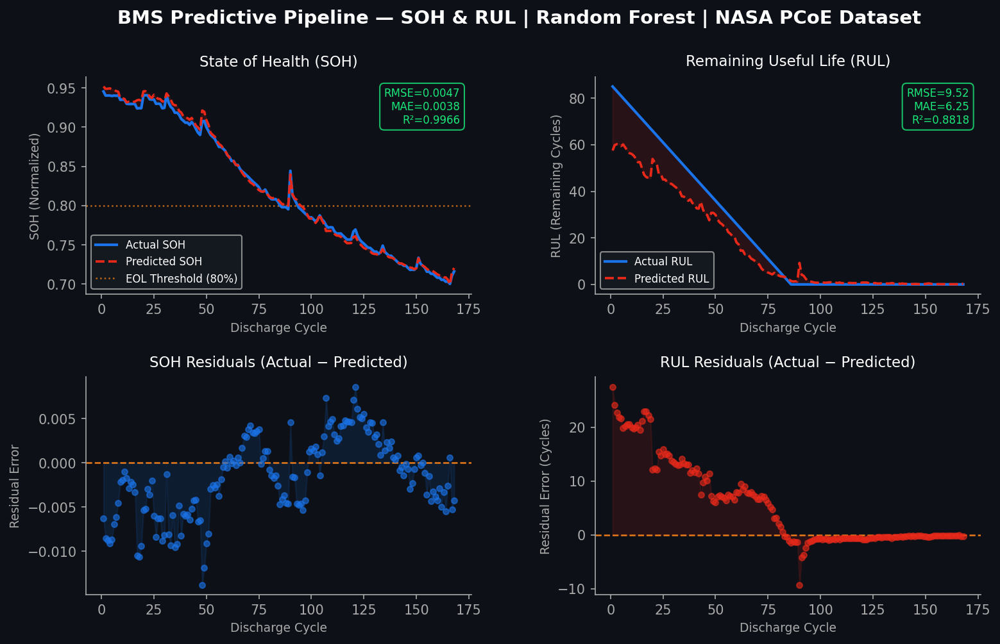
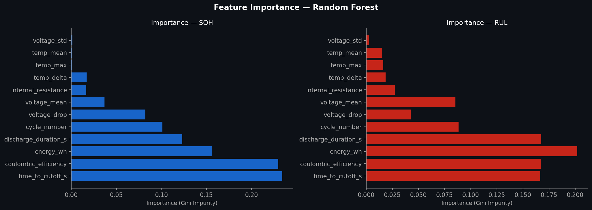

# BMS Predictive Pipeline: State of Health (SOH) & Remaining Useful Life (RUL)

**Course:** Pattern Recognition and Machine Learning - CPGEI-CT - UTFPR  
**Domain:** Battery Management Systems (BMS) / Machine Learning Engineering  

---

## ⏱️ 1. Context, Objectives & Acknowledgments

This project was developed as the final assignment for the **Pattern Recognition and Machine Learning** course, taught by Prof. André Lazzaretti.

Lithium-ion batteries degrade over time due to electrochemical wear. Accurate prognostics are critical to prevent catastrophic failures in electric vehicles and energy storage systems.
* **SOH (State of Health):** The battery's current capacity relative to its nominal capacity. (End-of-Life is considered at 80%).
* **RUL (Remaining Useful Life):** The exact number of discharge cycles remaining before the battery hits the End-of-Life (EOL) threshold.

### 🎯 Objectives
* **Course Objective:** Build a robust, data-driven regression pipeline to predict SOH and RUL using classical Machine Learning.
* **Research Objective:** Serve as a foundational proof-of-concept for ongoing Master's dissertation research in Applied Computing. This pipeline generates the necessary technical artifacts to critically evaluate whether the Random Forest algorithm is a viable and efficient baseline strategy for battery health prognostics within a Smart BMS architecture.

### 📚 References & Data Source
* **NASA PCoE Li-ion Battery Dataset:** The accelerated aging data used in this project was originally provided by the NASA Prognostics Center of Excellence (PCoE). 
* **Dataset Access:** Available on Kaggle via [this link](https://www.kaggle.com/datasets/ckskaggle/li-ion-battery-dataset-from-nasa-pcoe/data).

---

## 📊 2. Dataset & Data Engineering
We utilized the **NASA PCoE Li-ion Battery Dataset** (accelerated aging data).
* **Data Selection:** Processed `.mat` files dynamically instead of static `.csv` files to ensure scalability and quikly prototyping.
* **Feature Extraction:** Extracted physics-informed features from raw discharge cycles (Voltage, Current, Temperature, Time).
  * *Key Features:* Delivered Energy (Trapezoidal integration of $P = V \times |I| dt$), Ohmic Drop (Internal Resistance Proxy), Time to Cutoff, and Voltage Standard Deviation.

---

## 🧠 3. Methodology & Architecture
* **The Model:** `RandomForestRegressor` embedded in a `scikit-learn` Pipeline with `StandardScaler`. Selected for its robustness against non-linear degradation paths and native feature importance capabilities.
* **Architectural Highlight (Data Leakage Prevention):** * Standard random splitting destroys time-series integrity and causes target leakage.
  * *Solution:* We implemented a **Battery-Wise Split**. The model is trained on complete historical trajectories of specific cells (e.g., B0005, B0006, B0018) and tested on an entirely unseen cell (B0007). This strictly simulates real-world BMS deployment.

---

## 📈 4. Results & Visual Analytics
The pipeline generates an automated predictive dashboard evaluating the model on the unseen test cell.

### Performance Metrics
* **RMSE (Root Mean Square Error):** Heavily penalizes large prediction errors (Critical for safety in RUL).
* **MAE (Mean Absolute Error):** Direct target units (Ah percentage for SOH, cycles for RUL).
* **R²:** Explains the variance captured by the Random Forest.

<div align="center">
  
</div>

<div align="center">
  
</div>

### 4.1 Visual Analytics & Model Interpretation
Based on the generated evaluation dashboards, several critical behavioral insights can be drawn from the Random Forest baseline:

**State of Health (SOH) Tracking:**
* The model achieved an exceptional fit ($R^2 = 0.9966$) on the test cell. While tree-based models are prone to overfitting, the **Battery-Wise Split** architecture ensures this metric reflects true generalization to an unseen battery. The model successfully learned the underlying physical degradation patterns rather than memorizing a specific time series.

**Remaining Useful Life (RUL) Dynamics:**
* **Conservative Early Predictions:** During the early cycles (0–75), the predicted RUL slightly underestimates the actual RUL. In the context of safety-critical BMS applications, this "pessimistic" error is highly desirable, as underpredicting lifespan is strictly safer than overpredicting it (which could lead to unexpected field failures).
* **Late-Stage Convergence:** As the cell approaches the End-of-Life (EOL) threshold (~cycle 85), the prediction tightens significantly, perfectly tracking the post-EOL flatline.

**Feature Importance & Dimensionality Reduction:**
* **Dominant Predictors:** `time_to_cutoff_s`, `coulombic_efficiency`, and `energy_wh` hold the vast majority of the Gini impurity weight for both tasks.
* **Pruning Opportunity:** Thermal features (`temp_mean`, `temp_max`) and `voltage_std` show near-zero importance for SOH estimation. Future deployments on embedded microcontrollers (with constrained RAM/Compute) can safely drop these features with negligible loss in predictive power, optimizing execution speed.

---

## 🚀 5. Conclusion & Future Work
The Random Forest baseline proved highly effective for feature-engineered tabular data. However, the architecture is designed to be plug-and-play for future iterations.
* **Future Work 1:** Implement Hyperparameter Optimization (`RandomizedSearchCV`) to fine-tune the tree ensembles.
* **Future Work 2:** Transition from tabular models to sequential Deep Learning architectures (LSTMs or Transformers) to capture temporal dependencies without manual feature engineering.

---
### ⚙️ How to Run

1. Ensure the NASA .mat files are inside the `/data_mat/` directory:
[Nasa Dataset](https://www.kaggle.com/datasets/ckskaggle/li-ion-battery-dataset-from-nasa-pcoe/data)
2. Run the main orchestrator:
```bash
python3 bms_soh_rul_pipeline.py